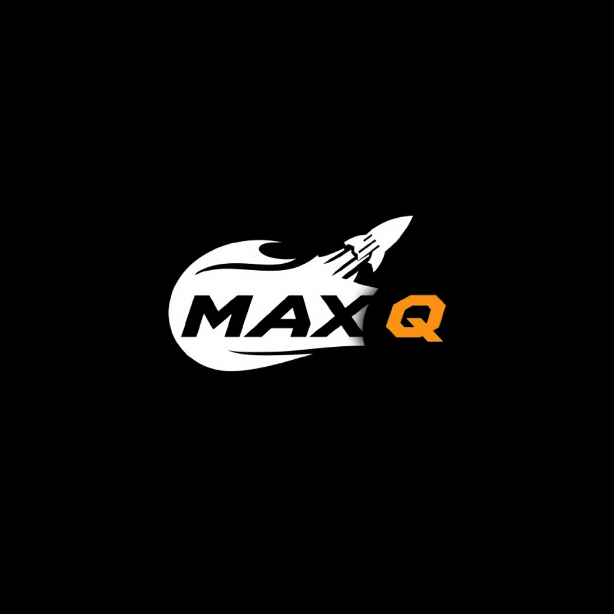
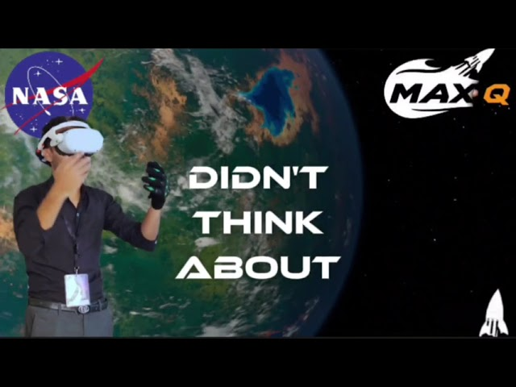
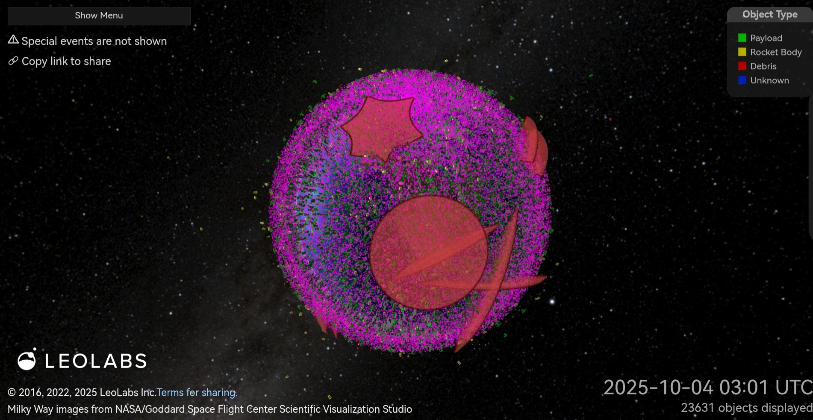
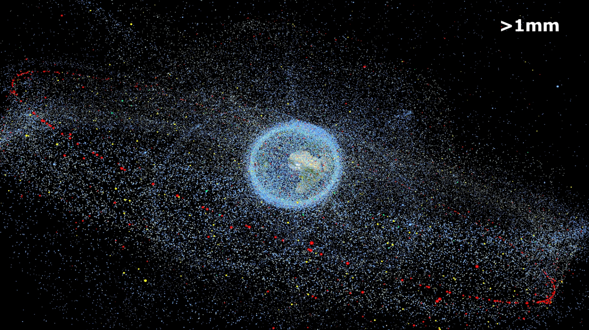
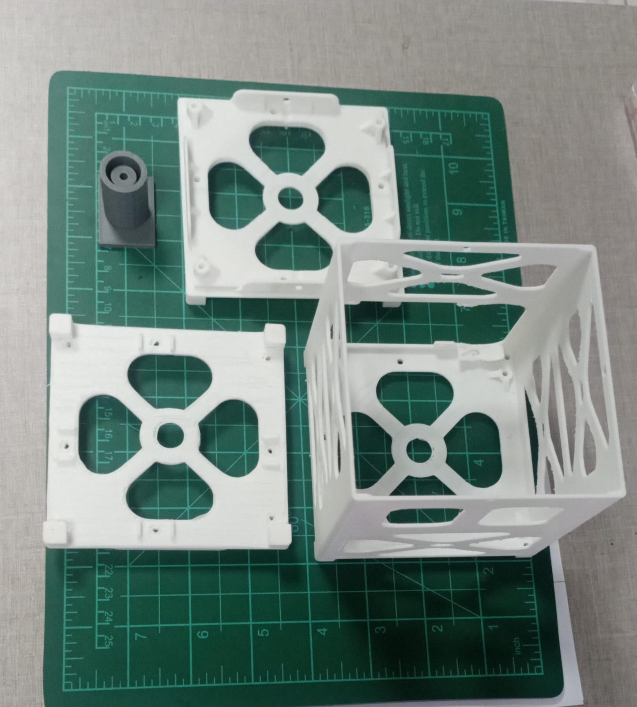
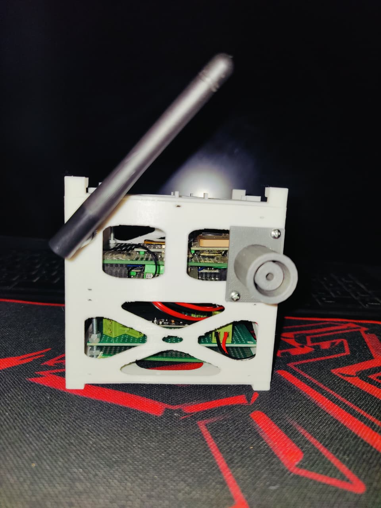
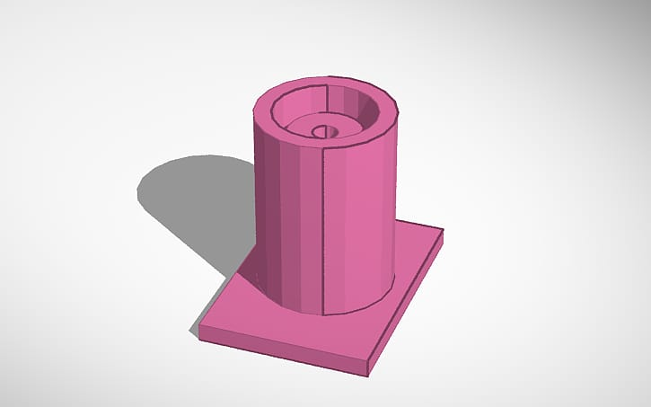

  
    
     
  <b>NASA Space Apps 2025 — Shared Orbital Bus (SOB)</b>  

  

---

  
    
    

  

  
    

  

---

## Executive Summary  

Low Earth Orbit (LEO) supports diverse missions: Earth observation, communications, navigation, microgravity research, on-orbit manufacturing, and space tourism.  
The orbital environment is increasingly congested: **>40,000 tracked objects** and **~11,000 active payloads**, with millions of fragments below catalog thresholds [1][2].  

**Concept — Shared Orbital Bus (SOB):**  
A modular ESPA-class spacecraft hosting multiple independent payloads and providing shared services:  

- Electrical power, propulsion, ADCS, thermal control, and communications  
- Standardized docking and refueling port  
- Active end-of-life deorbit capability  

**Expected Outcomes:**  
- Reduced per-payload cost through bus and launch cost sharing  
- Lower orbital object count and lifecycle risk  
- Shorter integration and market access for payload providers  
- Built-in sustainability via servicing and disposal workflows  

  
    

  

---

## Problem Definition  

- Increasing LEO demand → multiple redundant buses and propulsion systems per payload.  
- ESA (2025) reports ~40,000 tracked objects; NASA ORDEM predicts collision probability rising with debris flux [1][2].  
- Result: higher launch cadence, higher operational cost, greater collision risk.  

  
    

  

---

## Proposed Solution  

**Core Structure**  
- ESPA-class ring with integrated service module  
- Includes EPS, ADCS, propulsion, thermal management, and avionics  

**Hosted Payloads**  
- Six modular ports supporting hosted instruments or separable CubeSats  

**Service Port**  
- Standardized interface including electrical, data, and fluidic connections  
- Docking compatible with robotic servicing (heritage from NASA RRM and MEV)  

  
    
    
    

---

## Value Proposition  

- **Cost Efficiency:** Shared bus architecture amortizes development and launch costs  
- **Faster Deployment:** Payload developers bypass bus development and ground segment creation  
- **Sustainability:** Standardized servicing and controlled end-of-life deorbit reduce debris accumulation  
- **Flexibility:** Capable of supporting scientific, commercial, and communications payloads  

---

## Methodology  

1. Baseline architecture: ESPA-class mechanical interface  
2. Payload accommodation: 4–6 hosted ports, two service ports  
3. Orbital environment analysis: NASA ORDEM 3.2 and ESA debris data for shielding and maneuver sizing  
4. Propulsion selection: electric propulsion for station-keeping and deorbit, monopropellant backup for contingencies  
5. Docking/refueling interface derived from RRM lessons  
6. Economic model comparing shared bus vs. single-payload buses  

---

## Team MAX-Q  

- Ahmed Mohamed — Space Systems Engineer  
- Khaled Hassan — Public Engagement Specialist  

---

## References    

[1] [European Space Agency, *ESA Space Environment Report 2025*, 2025.](https://www.esa.int/Space_Safety/Space_Debris/ESA_Space_Environment_Report_2025)  

[2] [NASA Orbital Debris Program Office, *ORDEM (Orbital Debris Engineering Model)*, 2024.](https://orbitaldebris.jsc.nasa.gov/modeling/ordem.html)  

[3] [NASA, *Small Spacecraft Technology State of the Art — Platforms*, 2024.](https://www.nasa.gov/wp-content/uploads/2023/01/2-soa-platforms-2024.pdf)  

[4] [Moog, *ESPA Users Guide / ESPAStar Technical Datasheet*.](https://www.moog.com/content/dam/moog/literature/sdg/space/structures/moog-espa-users-guide-datasheet.pdf)  

[5] [NASA, *Robotic Refueling Mission (RRM3) Factsheet*, 2023.](https://www.nasa.gov/wp-content/uploads/2023/10/rrm-factsheet.pdf)  

[6] [ResearchGate, *Launch Cost Per Kilogram to Low Earth Orbit (LEO)*, 2024.](https://www.researchgate.net/figure/Launch-Cost-Per-Kilogram-to-Low-Earth-Orbit-LEO-US-Thousands_fig1_361415873)  

[7] [MarketsandMarkets, *Satellite Payload Market — Forecast and Analysis*, 2024.](https://www.marketsandmarkets.com/Market-Reports/satellite-payload-market-223389741.html)  

[8] [NASA, *NASA Worldview*, 2025.](https://earthdata.nasa.gov/worldview)  

[9] [U.S. Geological Survey, *USGS EarthExplorer*, 2025.](https://earthexplorer.usgs.gov)  

[10] [European Space Agency, *Copernicus Open Access Hub*, 2025.](https://www.copernicus.eu)  
